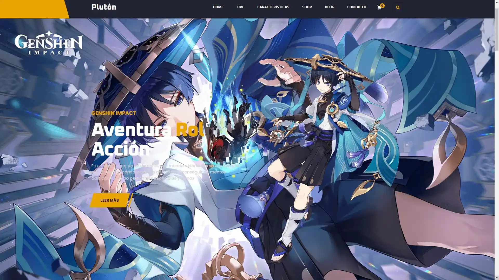
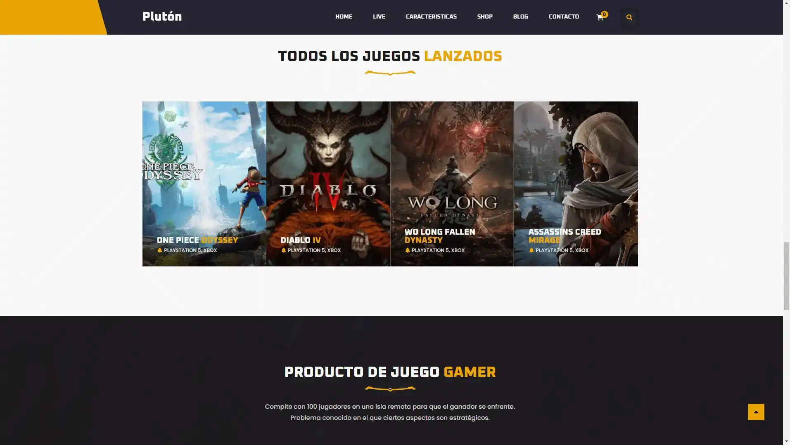
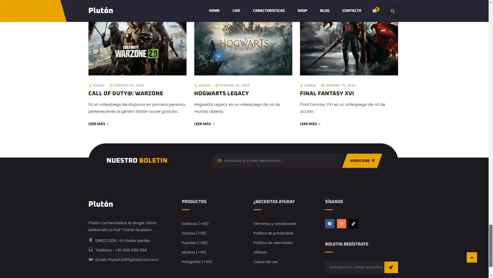

# Plutón/Gaming

**Plutón/Gaming**! Plutón es una aplicación web que simula una plataforma de videos como YouTube, permitiendo al usuario navegar por una serie de videos recomendados, buscar contenido, y explorar diferentes categorías de videos, todo en una interfaz simple y moderna.

## Índice

- [Descripción del Proyecto](#descripción-del-proyecto)
- [Tecnologías Utilizadas](#tecnologías-utilizadas)
- [Caracteristicas](#caracteristicas)
- [Estructura del Proyecto](#estructura-del-proyecto)
- [Funcionalidades](#funcionalidades)
- [Uso](#uso)
- [Contribuyentes](#contribuyentes)
- [Licencia](#licencia)
- [Imágenes y Videos](#imágenes-y-videos)

## Descripción del Proyecto

**Plutón/Gaming** es una plataforma en línea dedicada a mostrar videojuegos, con funciones para explorar juegos recomendados, realizar búsquedas y acceder a categorías como FPS, RPG, y más. La plataforma está desarrollada con HTML, CSS y JavaScript, y se enfoca en una experiencia interactiva y dinámica para el usuario.

## Tecnologías Utilizadas

Este proyecto utiliza las siguientes tecnologías y herramientas:

- **HTML5:** Estructura de la página.
- **CSS3:** Estilos de la página.
- **JavaScript:** Lógica de la tienda y del carrito de compras.
- **Font Awesome:** Íconos utilizados en la interfaz.
- **Google Fonts::** Fuentes personalizadas para la tipografía.

## Caracteristicas

Este proyecto incluye las siguientes características:

- **Página principal con juegos recomendados:** En la página principal, los usuarios podrán ver una selección de juegos recomendados.

- **Menú lateral interactivo:** Permite la navegación a través de diferentes categorías de juegos (FPS, RPG, Aventura, etc.).

- **Diseño responsivo:** El diseño se adapta a diferentes tamaños de pantalla, optimizando la visualización en dispositivos móviles.

- **Gestión de menú lateral:** El menú lateral puede ser ocultado o mostrado según el tamaño de la pantalla y la interacción del usuario.

## Estructura del Proyecto

La estructura del proyecto incluye los siguientes directorios principales:

```
└── 📁Plutón/Gaming
    └── 📁css
        └── responsive.css
        └── style.css
        └── variables.css
    └── 📁img
        └── acm.webp
        └── brand-1.png
        └── brand-2.png
        └── brand-3.png
        └── brand-4.png
        └── brand-5.png
        └── brand-6.png
        └── chaleco.jpg
        └── cod.jpg
        └── db.avif
        └── featured-game-icon.png
        └── ffx.jpeg
        └── footer-bottom-img.png
        └── genshin4.png
        └── grafica.jpg
        └── header-top-bg.jpg
        └── hero-bg.jpg
        └── hg.jfif
        └── latest-game-1.jpg
        └── latest-game-2.jpg
        └── latest-game-3.jpg
        └── live-match-banner.jpg
        └── live-match-player-1.png
        └── live-match-player-2.png
        └── live.jpg
        └── mando5.jpg
        └── op.jpg
        └── section-wrapper-bg.png
        └── shop-bg.jpg
        └── shop-img-1.jpg
        └── shop-img.jpg
        └── title-underline.png
        └── Trotamundos.png
        └── ts.png
        └── Tundra.webp
        └── wlfa.jfif
    └── 📁js
        └── script.js
    └── index.html
    └── logo.png
    └── README.md

```

## Funcionalidades

### 1. Menú Lateral Interactivo

El menú lateral es accesible a través de un botón de "hamburguesa" en la esquina superior izquierda. Este menú contiene enlaces a diferentes categorías de contenido, como:

```bash
Página Principal
```

```bash
FPS
```

```bash
RPG
```

```bash
Aventura
```

```bash
Python
```

```bash
Estrategia
```

```bash
Multijugador
```

```bash
Juegos en Vivo
```

El menú lateral es completamente interactivo, y su visibilidad se puede controlar tanto en dispositivos móviles como de escritorio.

### 2. Funcionalidad de Menú en Móviles:

En dispositivos móviles, el menú lateral se puede abrir y cerrar mediante el botón de menú. Esto se logra con la siguiente lógica en JavaScript:

```bash
const navbar = document.querySelector("[data-navbar]");
const navbarToggler = document.querySelector("[data-nav-toggler]");

navbarToggler.addEventListener("click", function () {
  navbar.classList.toggle("active");
  this.classList.toggle("active");
});


```

### 3. Barra de Búsqueda

La barra de búsqueda permite a los usuarios buscar juegos o contenido relacionado. Está conectada con la interfaz de usuario mediante un input y un botón para iniciar la búsqueda.

### 4. Juegos Recomendados

La página principal muestra una cuadrícula de juegos recomendados. Cada juego incluye una imagen destacada y enlaces a detalles adicionales.

### 5. Adaptabilidad del Diseño

El diseño es responsivo, lo que significa que se adapta a diferentes tamaños de pantalla. En dispositivos más pequeños (móviles), el menú lateral y otras partes de la página se ajustan para ofrecer una experiencia de usuario óptima.

## Uso

### 1. Visualización

Para visualizar la página:

°Clona o descarga este repositorio en tu máquina local.
°Abre el archivo index.html en tu navegador web.

```bash
git clone https://github.com/Hades0413/Gaming.git

cd Gaming

open index.html

```

### 2. Personalización

Puedes personalizar los juegos y las imágenes cambiando los enlaces a los archivos en el directorio de imágenes. Además, el archivo style.css contiene los estilos principales de la interfaz, que pueden ser modificados para adaptarlos a tus preferencias.

### 2. JavaScript

Los comportamientos interactivos, como la apertura y cierre del menú lateral y la barra de búsqueda, se gestionan en el archivo script.js.

## Contribuyentes

```bash
Eduardo Miguel Jaime Gomero (Hades0413)
```

## Licencia

Este proyecto está bajo la Licencia MIT. Puedes usar, modificar y distribuir el código con fines personales o comerciales.

## Imágenes y Videos

### Imágenes:

A continuación, se muestran algunas imágenes del formulario de autenticación (AuthForm) y otras vistas relevantes:

1. 
2. 
3. 

Videos:
Demo del Proyecto:
Cómo ejecutar el Proyecto:

```

```
